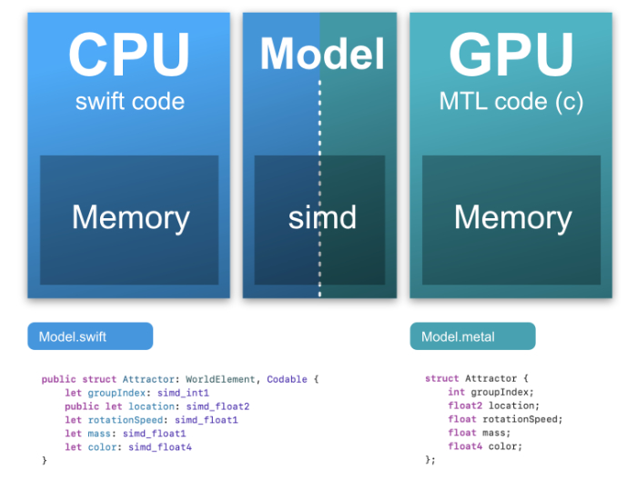
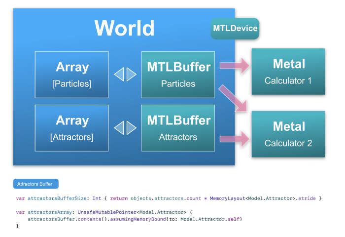
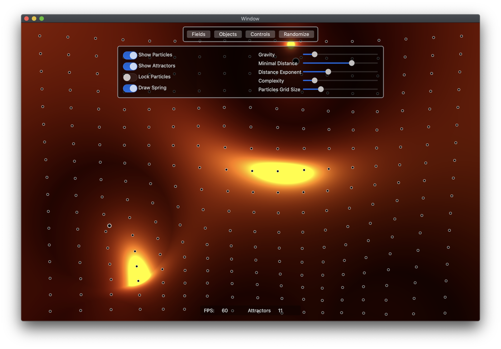
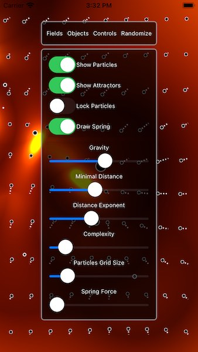

# MF-Metal-Example

## Introduction

### Initial goal

This project was originally intended to explain how to optimise computation using the Apple **Metal** framework. 

There is two examples of 'Metal Calculators' in this project:

- **Particles Calculator :** A simple computation optimized using the GPU power, using the Metal compute kernel. In this sample, we compute the gravity force applied to _n_ particles by _m_ attractors. 
- **Gravity FIeld Calculator :** A visual application, where a metal language function is used to process a 2d texture that is displayed in a Metal view. In this sample, we compute the gravity force applied by to each pixel of the view by _m_ attractors. The result is a visual representation of the gravity fields.

The first example is a good base to compute anything using the Metal compute kernel, without any graphic consideration. Trust me, it dramatically boost your apps.

_Maybe I will add a third example later - The vertex/shader renderer._

### Second goal

From there, since the result was quite amazing, I thought it would be a good idea to make a more solid project and propose an approach to architecture an app that use Metal framework.

So I propose a sketch of a safe and scalable schema that can serve as a 
base to any project.

### Last goal

- Make an app that runs on Mac and iPhone using as much common code as possible.
- Propose a mechanism that generates interface easily so anyone including me can have fun by adding new parameters seamlessly. It shows some usecases of generic constraints.

### Who's the public

This sample project is made for intermediate swift developper willing to have some insights on the Metal basics. 

It is also a guideline on how to architecture swift software in a safe and scalable way.

I don't pretend to give the highest code quality or the best possible architecture, but simply to share my way to achieve this, after years spent dealing with these problems.


### References


[Metal Language Specification](https://developer.apple.com/metal/Metal-Shading-Language-Specification.pdf)

[Metal Documentation](https://developer.apple.com/documentation/metal)

[SIMD Principles](https://www.sciencedirect.com/topics/computer-science/single-instruction-multiple-data)

[Apple SIMD Framework](https://developer.apple.com/documentation/swift/simd)


## Metal Model

The first important point to have in mind when coding for metal is that your data model will have to be shared between two worlds. The CPU and the GPU.

Note that even on the new Apple M1 processor, that make a big step by sharing the memory between the CPU and the GPU, you still will have to deal with alignments and data representation. GPU memory use SIMD alignments ( **S**ingle **I**nstruction, **M**ultiple **D**ata ).

The better way to keep the data organized is to have a `.swift` model that exactly mirrors the `.metal` model.

This way objects can be read or write to buffers easily and safely.

A good thing to have is some syntaxic sugar like `myCGFloatValue.simd` or `mySimdValue.cgFloat` to pass values from Cocoa/AppKit to simd.



## World

**MTLBuffers** are used to store vectors of objects that will be passed to GPU. 
To avoid over-charging metal calculators objects and be able to share data among several calculators, it is a nice idea to group all buffers in a dedicated object.

I call it **World**, but it could be named anything. 
_Probably in souvenir of the world object, from video games. Where everything was defined._

Note that the world object also holds a **MTLDevice** object that will be shared with everyone. In complex cases, a computer can have multiple GPUs, hence multiple MTLDevices.
In our example, we use one MTLDevice only.

**MTLDevice** is needed, because buffers are created in a given device memory.

It is a good thing to have some utils to convert **MTLBuffers** to swift Array.
See an example of code in the figure below.




## <font color='#1E72AD'>Required frameworks</font>

Two frameworks are installed using cocoapods:
- **SnapKit :** A fantastic framework to handle constraints with no pain.
- **MoofFoundation :** Some of my most used code. A home made collection of utilities to extend Apple Foundation, Quartz, Metal, AppKit and Cocoa frameworks.

```
cd 'MF Metal Example'
pod install
```

### <font color='#1E72AD'>Mac OS Screenshot</font>



### <font color='#1E72AD'>iOS Screenshot</font>



## Overview

## <font color='#1E72AD'>Author</font>

Tristan Leblanc <tristan@moosefactory.eu>

Twitter     :    <https://www.twitter.com/tristanleblanc>  

***


## <font color='#1E72AD'>License</font>

MoofFoundation is available under the MIT license. See the [LICENSE](LICENSE) file for more info.

***

Updated 2016-12-09
